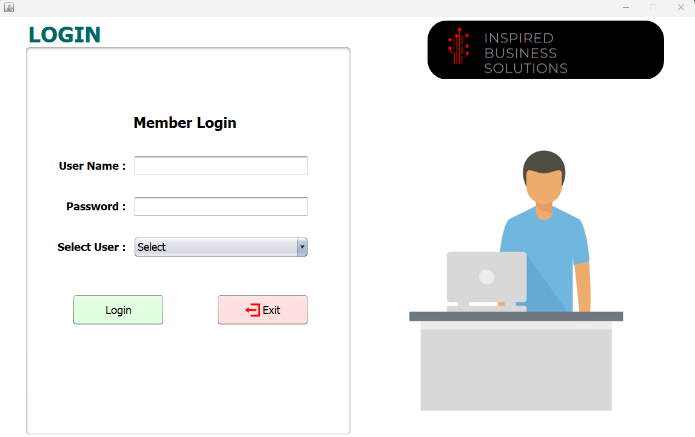
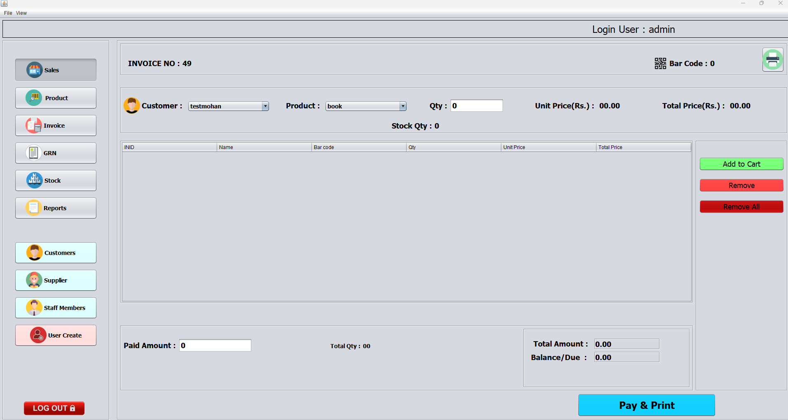
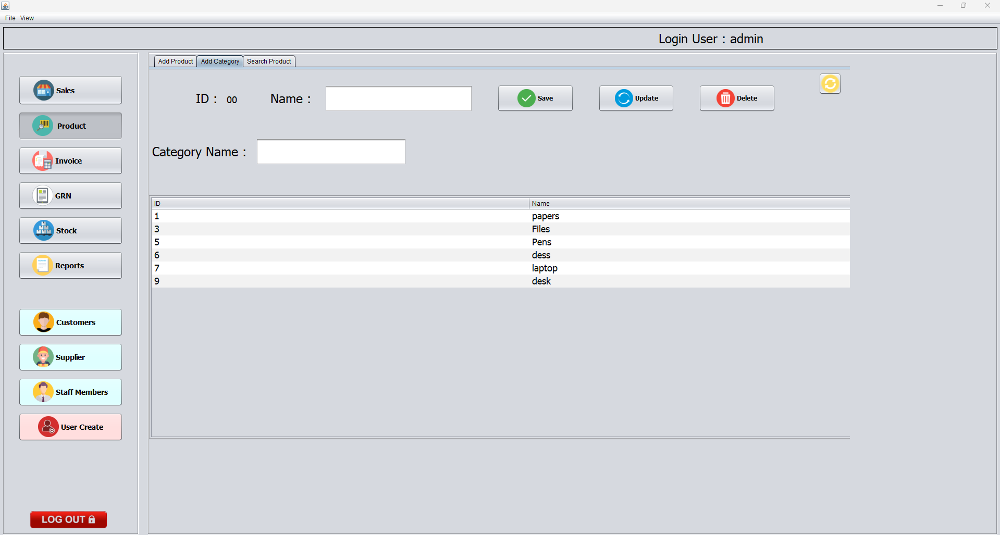
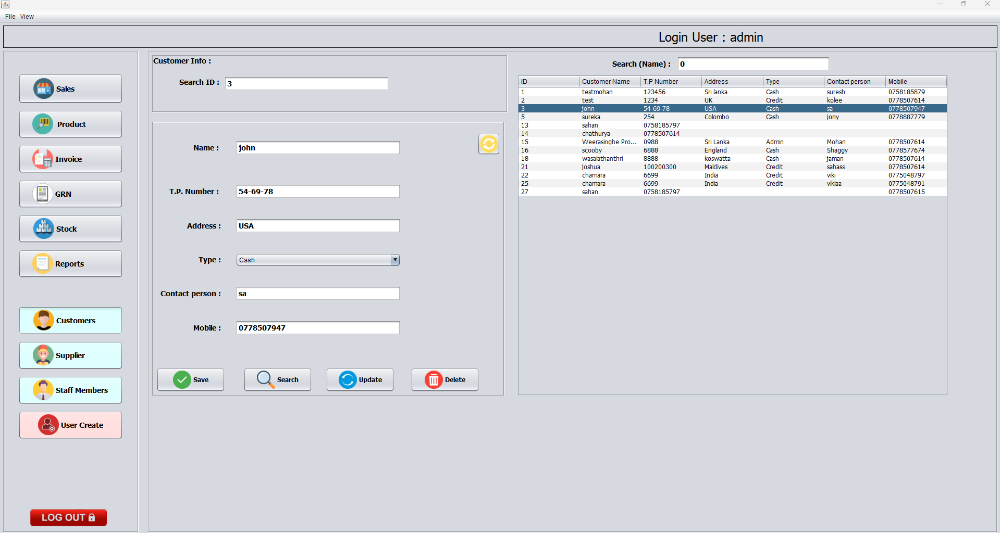

# PosPro: Inventory management system 📦🧾 🛒

Welcome to PosPro, your go-to solution for Inventory management system! 🚀 This Windows Application, developed using Java and Netbeans, empowers users to effortlessly manage their stock, keeping everything organized and easily accessible on the go.

## 📸 Screenshots

## 🚀 Features

- **CRUD Application:** You can Add, Delete, Update, and View items
- **Report:** Can get the reports
- **Billing:** Billing System
- **Data Export:** Mysql database  📊

## 🤝 Contributing

Contributions are welcome! Follow these steps to contribute:

1. Fork the repository.
2. Create a branch: `git checkout -b feature/new-feature`.
3. Commit your changes: `git commit -m 'Add new feature'`.
4. Push to the branch: `git push origin feature/new-feature`.
5. Open a pull request.

## 📜 License

This project is licensed under the MIT License - see the [LICENSE](LICENSE) file for details.

## 📧 Contact

Have questions, suggestions, or just want to chat? Reach out to us at [wmohankavinda@gmail.com](mailto:wmohankavinda@gmail.com).

---
Happy coding! 🚀✨
